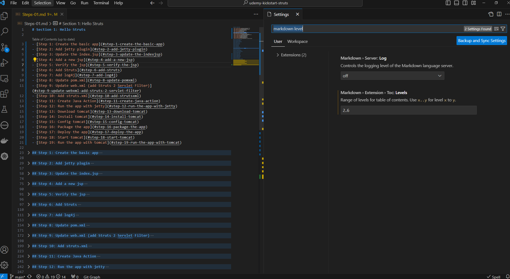

# Markdown TOC

## VSCode extension - Markdown All in One


Here's how you can use the "Markdown All in One" extension to generate a TOC in VS Code:

1. Install the "Markdown All in One" extension:
   - Open VS Code.
   - Click on the "Extensions" icon in the sidebar (or use the keyboard shortcut `Ctrl+Shift+X`).
   - Search for "Markdown All in One" and click the "Install" button for the extension by Yu Zhang.

2. Open your README.md file in VS Code.

3. Place your cursor where you want the TOC to be generated.

4. Press `Ctrl+Shift+P` (or `Cmd+Shift+P` on macOS) to open the command palette.

5. Search for "Markdown All in One: Create Table of Contents" or "Markdown All in One: Update Table of Contents" and select it.

6. The extension will generate a TOC and insert it into your README.md file at the location of your cursor.

The generated TOC will automatically include links to the headings in your document, making it easier for readers to navigate your Markdown file.

Please note that you should make sure that your headings (e.g., ## Step 1: Create the basic app) are properly formatted in Markdown for the extension to generate an accurate TOC.

"Markdown All in One" is a versatile extension for Markdown editing in VS Code and offers other useful features for Markdown documents as well.

## Markdown All in One is good. However, it added the title (I used # for it) to the TOC. How to remove it? I only want ## and ###... to be added in the TOC

<!-- If you want to exclude the top-level title (created with a single `#`) from the generated Table of Contents (TOC) in the "Markdown All in One" extension in Visual Studio Code, you can customize the extension's settings to exclude specific heading levels. Here's how to do it:

1. Open your VS Code settings:

   - Click on the gear icon (⚙️) in the bottom left corner and select "Settings" from the menu.
   - Or use the keyboard shortcut `Ctrl+,` (or `Cmd+,` on macOS).

2. In the settings, search for "Markdown All in One."

3. Click on "Edit in settings.json" on the right-hand side. This will open the `settings.json` file specifically for the "Markdown All in One" extension.

4. In the `settings.json` file, add the following configuration to exclude the top-level title from the TOC:

```json
"markdown.extension.toc.levels": [2, 3]
```

The above setting specifies that only heading levels 2 (`##`) and 3 (`###`) should be included in the generated TOC, excluding the top-level title (level 1).

5. Save the `settings.json` file.

Now, when you generate the TOC using "Markdown All in One," it will only include heading levels 2 and 3 in the TOC, excluding the top-level title. -->




Here's an example of what the TOC might look like:

```markdown
<!-- TOC -->
- [Step 1: Create the basic app](#step-1-create-the-basic-app)
- [Step 2: Add jetty plugin](#step-2-add-jetty-plugin)
- [Step 3: Update the index.jsp](#step-3-update-the-indexjsp)
- [Step 4: Add a new jsp](#step-4-add-a-new-jsp)
- [Step 5: Verify the jsp](#step-5-verify-the-jsp)
- [Step 6: Add Struts](#step-6-add-struts)
- [Step 7: Add log4j](#step-7-add-log4j)
- [Step 8: Update pom.xml](#step-8-update-pomxml)
- [Step 9: Update web.xml (add Struts 2 Servlet Filter)](#step-9-update-webxml-add-struts-2-servlet-filter)
- [Step 10: Add struts.xml](#step-10-add-strutsxml)
- [Step 11: Create Java Action](#step-11-create-java-action)
- [Step 12: Run the app with jetty](#step-12-run-the-app-with-jetty)
- [Step 13: Download tomcat](#step-13-download-tomcat)
- [Step 14: Install tomcat](#step-14-install-tomcat)
- [Step 15: Config tomcat](#step-15-config-tomcat)
- [Step 16: Package the app](#step-16-package-the-app)
- [Step 17: Deploy the app](#step-17-deploy-the-app)
- [Step 18: Start tomcat](#step-18-start-tomcat)
- [Step 19: Run the app with tomcat](#step-19-run-the-app-with-tomcat)
<!-- /TOC -->
```

The top-level title (level 1) will be excluded from the TOC.

Note: it is possible to use the `settings.json` file but sometimes it doesn't work.

## (Not a VSCode extension) doctoc

Yes, there are more tools and libraries available that can automatically generate a Table of Contents (TOC) for your Markdown documents, including README.md files. One popular tool for this purpose is "doctoc." Doctoc is a command-line utility that scans your Markdown files and generates a table of contents based on the headings in your document.

To use doctoc, you need to install it first. You can install it globally using npm (Node Package Manager) with the following command:

```bash
npm install -g doctoc
```

Once doctoc is installed, you can generate a TOC for your README.md file by running the following command in your project directory:

```bash
doctoc README.md
```

Doctoc will scan the file, identify the headings (##) and generate a table of contents with links to those headings. It will add the TOC to the beginning of your README.md file.

Here's how your TOC might look after using doctoc:

```markdown
<!-- TOC -->
- [Step 1: Create the basic app](#step-1-create-the-basic-app)
- [Step 2: Add jetty plugin](#step-2-add-jetty-plugin)
- [Step 3: Update the index.jsp](#step-3-update-the-indexjsp)
- [Step 4: Add a new jsp](#step-4-add-a-new-jsp)
- [Step 5: Verify the jsp](#step-5-verify-the-jsp)
- [Step 6: Add Struts](#step-6-add-struts)
- [Step 7: Add log4j](#step-7-add-log4j)
- [Step 8: Update pom.xml](#step-8-update-pomxml)
- [Step 9: Update web.xml (add Struts 2 Servlet Filter)](#step-9-update-webxml-add-struts-2-servlet-filter)
- [Step 10: Add struts.xml](#step-10-add-strutsxml)
- [Step 11: Create Java Action](#step-11-create-java-action)
- [Step 12: Run the app with jetty](#step-12-run-the-app-with-jetty)
- [Step 13: Download tomcat](#step-13-download-tomcat)
- [Step 14: Install tomcat](#step-14-install-tomcat)
- [Step 15: Config tomcat](#step-15-config-tomcat)
- [Step 16: Package the app](#step-16-package-the-app)
- [Step 17: Deploy the app](#step-17-deploy-the-app)
- [Step 18: Start tomcat](#step-18-start-tomcat)
- [Step 19: Run the app with tomcat](#step-19-run-the-app-with-tomcat)
<!-- /TOC -->
```

With this generated TOC, readers can easily navigate your README.md file by clicking on the links in the table of contents.

Keep in mind that you'll need to have Node.js and npm installed on your system to use doctoc.
